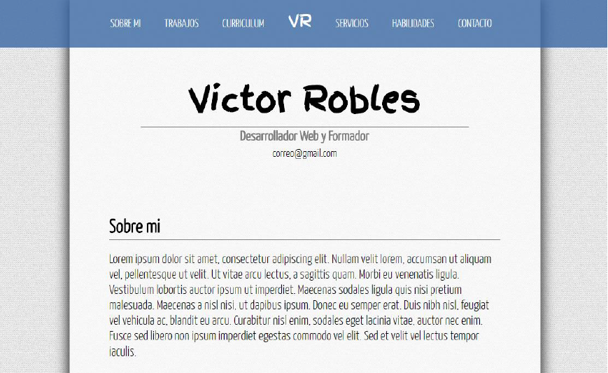
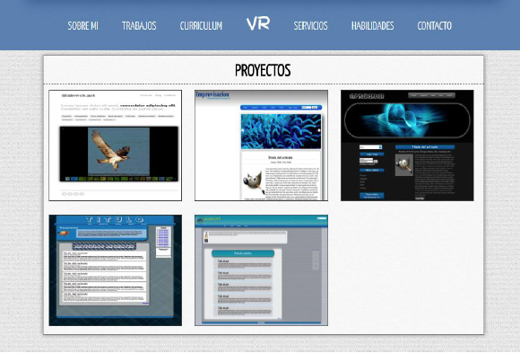

# WebApp-DR

Ejercicio de desarrollo WebApp Angular Master de programación UDEMY. 
[Contenido del curso](https://www.udemy.com/course/master-en-javascript-aprender-js-jquery-angular-nodejs-y-mas/?src=sac&kw=master%20en%20javascript%20jque)

### STATUS: *** FINALIZADO *** ###

Objetivos del ejercicio:
- [X] Maquetar una webAPP parecida a esta

- [X] Hacer diferentes secciones, cada una en una página distinta.
        a. Sobre mi
        b. Proyectos
        c. Crear Proyectos
        d. Contacto
- [X] En la sección de crear proyectos, hacer un formulario que guarde nuevos proyectos en el backend(NodeJS) usando el API REST.
- [X] Listar los proyectos en la sección de Proyectos.

- [X] Página individual del proyecto.
- [X] Botón de editar proyecto, y hacer que funcione.
- [X] Botón de borrar proyecto, y hacer que funcione.

This project was generated with [Angular CLI](https://github.com/angular/angular-cli) version 11.2.4.

## Development server

Run `ng serve` for a dev server. Navigate to `http://localhost:4200/`. The app will automatically reload if you change any of the source files.

## Code scaffolding

Run `ng generate component component-name` to generate a new component. You can also use `ng generate directive|pipe|service|class|guard|interface|enum|module`.

## Build

Run `ng build` to build the project. The build artifacts will be stored in the `dist/` directory. Use the `--prod` flag for a production build.

## Running unit tests

Run `ng test` to execute the unit tests via [Karma](https://karma-runner.github.io).

## Running end-to-end tests

Run `ng e2e` to execute the end-to-end tests via [Protractor](http://www.protractortest.org/).

## Further help

To get more help on the Angular CLI use `ng help` or go check out the [Angular CLI Overview and Command Reference](https://angular.io/cli) page.
